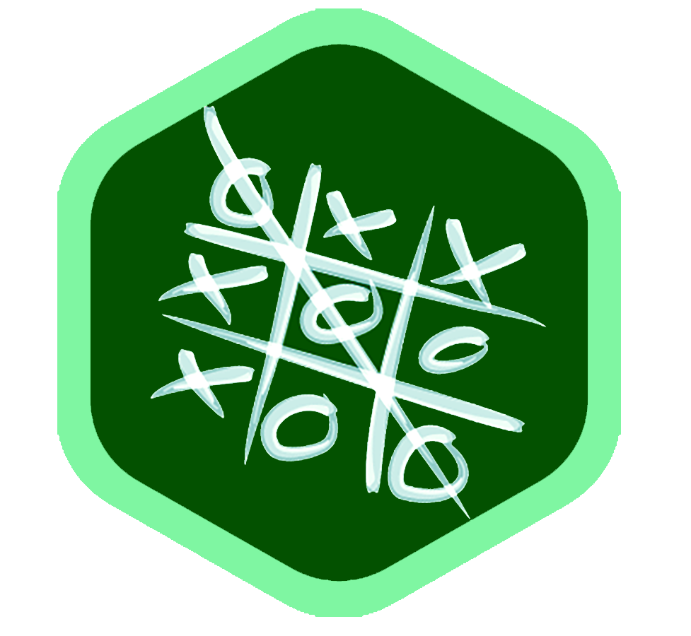

# Tic-Tac-Toe Web Game


<p align=center>
    
</p>


This **Tic-Tac-Toe** game is designed with **`Python`**.  The *client-side-scripting* of this website is also done with **`Python`**, which makes the **DOM (Document Object Model)** manipulation easy. To use **`Python`** in *client-side-scripting*,  a **Python to JavaScript Compiler** is used, named [**`Brython`**](https://brython.info/static_tutorial/en/index.html).

<br>

### Brython

---

**`Brython`** is a **Python to JavaScript Compiler**, but it does the whole job in the **browser** and so makes **`Python`** appear to be a *client-side-scripting-language*.  **`Brython`** is another of the growing examples of treating **`JavaScript`** as an *assembly-language*. In this case, though, the approach is slightly different, but the idea is that **`Python`** can be written in the **browser** as if it was a language with **built-in browser support**. 

#### How Brython works?

What **`Brython`** does is to locate **`Python`** script tags and replace them with **`JavaScript`** script tags containing the equivalent *JavaScript code*. That's why **`Brython`** stands for **Browser Python**.  **`Brython`** compiles the *Python code* into *JavaScript* as the page is loaded. It's a clever method and its only real cost is the time it takes to compile. If this is unacceptable then the code can be compiled "offline" and insert the equivalent JavaScript into the page. 

Of course the big **disadvantage** of compiling anything to **`JavaScript`** is that direct **debugging** has to be done in terms of **`JavaScript`** rather than the **original language**.

See **`Brython`**'s official [**documentation**](https://brython.info/static_tutorial/en/index.html).

<br>

### Implementation of Brython

---

**`Brython`** helps to use **`Python`** as *client-side-scripting language*. So the job is to load **Brython libraries when the pages get loaded, and then add **Python code** with *html script tag*. **`Brython`** will process the **`Python`** code and generate equivalent **`JavaScript`** code.

<br>

> 1. Adding **Brython libraries**

**Brython libraries** are plugged-in by calling **`brython()`** function on page load. Usually, this function is called in **`<body>`** tag.

```html
<!DOCTYPE html>
<html lang="en">
    <head>
        ...
        ...
    </head>
    
    <body onload="brython()">
        ...
        some html code
        ...
    </body>
</html>
```

This **`brython()`** function will plug all the brython libraries in the html code. For that, the brython libraries source are need to be added inside **`<head>`** tag:

```html
<head>
    ...
    ...
    <script type="text/javascript" src="https://cdn.jsdelivr.net/npm/brython@3.8.10/brython.min.js"></script>
    <script src="https://cdn.jsdelivr.net/npm/brython@3.8.10/brython_stdlib.js"></script>
</head>
```

Change the CDN link with most updated one.

<br>

> 2. Adding **Python script**

**Python script** is added with **`<script>`** tag, exactly in the same way how **`JavaScript`** usually added.

```html
<body>
    ...
    ...
    <script type="text/python" src="/script/main.py"></script>
</body>
```

Change the src path of **Python script** with your source path.

**Python script** can contain traditional **`Python`** code, and also **scripting code** provided by **`Brython`** in their documentation. **Python package and module** can also be used (see [documentation](https://brython.info/static_tutorial/en/index.html)).

---


<br><br>


#### Important Links

---

1. **`Python`** source code of **Tic-Tac-Toe game** : [**click here**](https://github.com/Shohrab-Hossain/Tic-Tac-Toe)
2. See this website in live: [**Play Tic-Tac-Toe**](https://tic-tac-toe-sh.herokuapp.com)
3. **`Brython`** official documentation: [**click here**](https://brython.info/static_tutorial/en/index.html)

